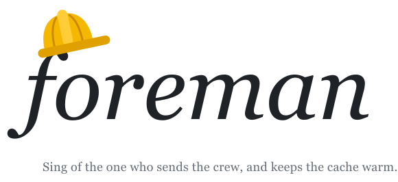

<p align="center">
  <picture>
    <source media="(prefers-color-scheme: dark)" srcset="assets/logo-dark.svg">
    
  </picture>
</p>

Foreman is a way to run a coding project in [Claude Code](https://claude.com/claude-code)
with one lead agent and a crew of worker agents, without running out of your usage
limit halfway through the week. It is a slash command, a few short prompt files and
an optional mod. This page explains where it came from and how to use it.

## What I did before

For a while I ran a project the obvious way. I kept one long chat open as the
lead. When I wanted something built, the lead started a general-purpose sub-agent
in its own git worktree, the sub-agent opened a pull request, and I reviewed it.
Nothing was written down. The lead decided each time how to brief an agent, when
to check on it, and how much to do itself.

It worked, in the sense that pull requests got merged. Then one chat that ran for
two days used about 90% of my weekly limit, and I had no idea why. So I wrote a
script to read the transcripts and count every model call.

## What the transcripts showed

Three things explained almost all of it.

**Agents re-read their whole context on every step.** 74% of that chat's cost was
cache reads. Sub-agents ran to 300k–960k tokens without compacting, and more than
half the cost came from calls made with over 400k tokens of context. One agent,
with 615 calls and a 964k peak, took 27% of the chat by itself. The number of
agents was not the problem: the 26 agents that stayed under 200k cost 5% in total.

**The cache expired while agents waited.** A sub-agent's prompt cache lasts five
minutes by default. An end-to-end test run takes five to fifteen. Each time an
agent waited longer than the cache, its next call wrote the whole context again
at full price. That was 13.6% of the cost.

**The lead did the work itself.** In a later chat the lead made about a thousand
calls at an average of 251k tokens, and three quarters of them were its own
commands: reading diffs, running git, debugging. That work costs the same number
of steps in a worker, but each step in a worker re-reads far less.

I fixed these one at a time over the next chats, and the cost per merged pull
request fell by about 40%. But the fixes lived in my head and in the lead's
memory, and each new chat forgot some of them. Foreman is those fixes written
down as rules the agents load.

## What Foreman is

You type `/foreman` in a session, in any repository, and that session becomes the
lead. The lead plans, writes a brief for each task and sends a worker. It does not
write code, debug or run tests. Each worker takes one brief, works in its own
worktree, hands back one result and stops.

There are five kinds of worker. They differ in model, effort, tools and how many
steps they may take:

| Worker | Job | Model, effort |
|---|---|---|
| builder | Build or fix something whose cause is known, and open a PR | Opus 5.5, medium |
| investigator | Find the cause of a bug or a flaky test, and write the fix brief | Opus 5.5, high |
| clerk | Merges, conflicts, renumbering, full test runs | Sonnet 5.5, medium |
| scout | Answer one factual question from the web, docs or code | Sonnet 5.5, medium |
| responder | Handle one round of a review bot's findings on a PR | Opus 5.5, high |

The rules behind them:

- **One task, one PR, one worker.** Follow-up work after review goes to a fresh
  worker, not back to the one that has grown.
- **Workers start small.** Each profile lists only the tools that worker needs, so
  it starts at about 10k tokens. The general-purpose agent I used before started
  at 46k and re-read that on every call.
- **Workers get a one-hour cache.** One setting, and a long test run no longer
  costs a full rewrite.
- **A handover file replaces old chats.** Each repository has one `HANDOVER.md`,
  shared by every worktree and kept out of git. A new lead starts from it. It also
  holds the repository's settings and the rules the lead copies into every brief,
  because workers can't see the lead's memory.
- **Sonnet for short jobs only.** Sonnet costs half as much per token, except for
  cache reads, which cost the same. Replaying my chats, that came to 24% less on
  long jobs and 43% less on short ones, so only clerks and scouts use it.

Two parts are optional. If a review bot such as Codex must approve your pull
requests, the lead runs a watcher and sends a responder for each round, up to a
cap. And `mod/foreman-board` is a Claude Code mod that runs inside the lead's
session: it shows every worker's steps, context and cost as they happen, refuses
a worker over the limit or a brief without rules, and compacts the lead when it
passes 200k tokens.

## How the first run went

The first full session under Foreman ran seven hours with 118 workers, most of
them review rounds on a stack of 22 pull requests.

What worked: no cache was rewritten after a wait, where it had been 10–14% of the
cost before. Workers started at about 10k tokens and none went above 223k.

What didn't: the lead grew to 809k tokens before it was compacted, and took 41% of
the session's cost. The rule said the lead should ask me to compact at 200k. It
didn't ask, and when I tried, a `/compact` typed while the lead was busy arrived as
plain text. The lead also posted 126 messages, far more than I could read. The
mod's automatic compaction is my answer to the first problem. It has not run in a
real session yet, so I can't tell you it works.

[`CHANGELOG.md`](CHANGELOG.md) keeps this record for each version: what changed,
what to check when testing, and what was measured.

## Setting it up

You need Claude Code. The files refer to themselves at
`~/Developer/harness/foreman`, so clone there, or change the paths in
`skills/foreman/SKILL.md`, `lead.md` and `review-bot.md`.

```bash
git clone https://github.com/chengluyu/foreman.git ~/Developer/harness/foreman
```

Install the worker profiles and the command:

```bash
cp ~/Developer/harness/foreman/agents/foreman-*.md ~/.claude/agents/
```

```bash
mkdir -p ~/.claude/skills/foreman && cp ~/Developer/harness/foreman/skills/foreman/SKILL.md ~/.claude/skills/foreman/
```

Give workers the one-hour cache in `~/.claude/settings.json`:

```json
{ "subagentPromptCacheTtl": "1h" }
```

Then start a new session in any repository and type:

```text
/foreman
```

The first time in a repository, the lead asks four things: whether a review bot
is in use, whether Sonnet workers are allowed, which builder profile to use, and
which rules every worker must follow. It writes the answers into the handover.
After that it tells you in five lines where things stand.

The mod is early access and needs Claude Code 2.1.286 or later. To load it, add
`mod/foreman-board` to `CLAUDE_CODE_PLUGIN_DIRS` in the `env` block of
`~/.claude/settings.json`.

## Where to read more

- [`FOREMAN.md`](FOREMAN.md) is the full guide: how the cost works, and the
  measurement behind each rule.
- [`lead.md`](lead.md) is what the lead actually loads. It is short on purpose,
  because the lead re-reads it on every step.
- [`agents/`](agents) holds the worker profiles.

Foreman is at version 0.5.0 and has run one full session. Until 1.0.0, a minor
version may change behaviour or cost.
